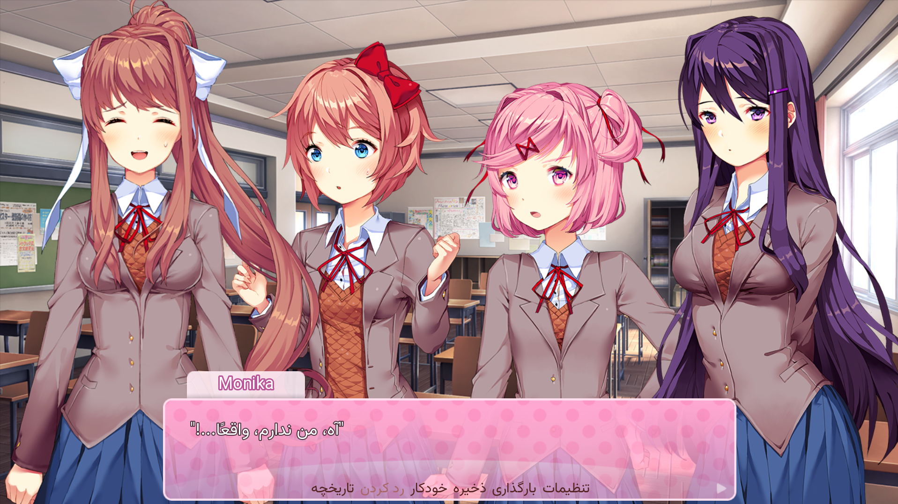

Markdown
<div align="center">

# 🎀 Doki Doki Literature Club! - Persian Language Mod
### ترجمه فارسی بازی دوکی دوکی 



**A seamless, non-destructive Persian (Farsi) localization mod for DDLC.**  
*Adds Persian as a fully selectable language inside the game's Settings menu without overwriting the original English text.*


-success?style=for-the-badge)


</div>

---

## 📖 About This Mod

The **DDLC Persian Language Mod** integrates **Persian (فارسی)** as a brand-new, native language option into **Doki Doki Literature Club!**. 

Unlike traditional translation mods that overwrite core game files and force you to play in only one language, this project utilizes Ren'Py's translation framework to add Persian directly to the **Language Settings**. This allows players to instantly toggle between **English** and **Persian** at any point during gameplay.

The original English localization and pure DDLC experience remain completely untouched.

---

## ✨ Features

*   🇮🇷 **Native Persian Support:** Adds Persian (Farsi) as a brand-new language.
*   ⚙️ **In-Game Toggle:** "فارسی (Persian)" appears seamlessly in the standard Settings menu.
*   🌍 **Non-Destructive:** Original English text and game files remain completely intact.
*   🔄 **Instant Switching:** Switch between English and Persian on the fly without restarting.
*   💬 **Full Localization:** Complete Persian UI, menu, and dialogue support.
*   🛠 **Clean Implementation:** Highly organized Ren'Py codebase built specifically for DDLC.

---

## 📸 Screenshots

*(Replace the paths below with your actual screenshot files once uploaded to the `images` folder)*

<div align="center">
  
  
</div>

---

## 🚀 How to Install

1.  **Download** the latest release of this mod from the [Releases page](../../releases) (or clone the repository).
2.  **Extract** the downloaded `.zip` file.
3.  Open your **Doki Doki Literature Club** game directory.
4.  Copy the `game` folder from the mod and paste it directly into your base DDLC directory (merge folders if prompted).
5.  Launch the game (`DDLC.exe`).
6.  Navigate through the menu:
    > **Settings ➔ Language ➔ فارسی (Persian)**
7.  Enjoy playing DDLC in Persian! 🎉

---

## 📂 Project Structure

```text
DDLC-Persian-Language/
│
├── game/
│   ├── tl/
│   │   └── persian/      # Core Persian translation files (.rpy)
│   ├── options.rpy
│   └── script.rpy
│
├── images/               # Banners and screenshots for the README
│   ├── banner.png
│   └── screenshot1.png
│
├── README.md
└── LICENSE
🎯 Project Goals
Our goal is to provide the Iranian and Persian-speaking community with a clean, high-quality localization of Doki Doki Literature Club while strictly preserving Team Salvato's original artistic vision and gameplay experience.

🛠 Built With
Ren'Py Visual Novel Engine

Python

RPY Scripts

❤️ Contributing & Feedback
Translations are a massive effort, and community help is always appreciated!
If you spot a typo, have a better translation for a specific line, or want to report a bug, feel free to open an Issue or submit a Pull Request.

⭐ Support
If you enjoy playing DDLC in Persian and appreciate the work put into this project, please consider leaving a ⭐ Star on this GitHub repository! It helps others find the mod.

👨‍💻 Author
Created with ❤️ by k_F_

GitHub: @kiyanfnaflover-ui

📜 Disclaimer & Legal
This is a fan-made, non-profit localization project.

Doki Doki Literature Club! and all related assets, characters, and storylines are the intellectual property of Team Salvato.

This repository only provides translation/localization files and does not claim ownership of the original game or its assets. You must download the base game separately to use this mod.


### 🔍 Why this is better for Google (SEO) & GitHub indexing:
1.  **Keyword Density:** Added highly searched terms like *"Farsi"*, *"Localization"*, *"Translation"*, *"ترجمه فارسی"* and *"DDLC"* naturally into the text. People search for these specific terms on Google.
2.  **Optimized Image Alt-Text:** Search engines can't read images. Changing `alt="DDLC Persian Language Mod Banner"` to `alt="Doki Doki Literature Club DDLC Persian Farsi Translation Mod Banner"` tells Google Images exactly what the project is about.
3.  **Clearer Navigation:** Bolding key phrases, using blockquotes for the installation path, and putting GitHub links into actual hyperlink markdown formats (`[@username](link)`) improves the page's structure, which search engines favor.
4.  **Actionable Installation:** Breaking the installation down into clearer, bolded
